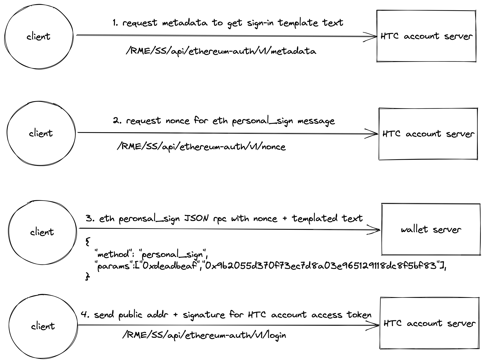

# Ethereum Authentication Flow


This flow is **only** support for HTC OAuth client with **password grant type**, if need this integration, please contact us for expanding OAuth client access control or other solution.


HTC Account support Ethereum authentication with identity's **capitalization encoded checksum** Ethereum address. After identity **already connected** to an Ethereum wallet app, HTC account integrated app client could get HTC account access token by this flow. Scenario is as following:\





Ethereum address performing the signing conformant to **capitalization encoded checksum** specified in EIP-55 where applicable.


### HTC Account Server Host Environment

| ENV   | Resource Domain                    |
| ----- | ---------------------------------- |
| STAGE | ​https://account-stage.htcvive.com |
| PRDO  | ​https://account.htcvive.com       |

### HTC Account Profile Server Host Environment

| ENV   | Resource Domain                           |
| ----- | ----------------------------------------- |
| STAGE | https://account-profile-stage.htcvive.com |
| PROD  | https://account-profile.htcvive.com       |

### API SPEC







**capitalization encoded checksum**

 ethereum address



extra data payload for HTC account



HTC OAuth client's client id



HTC OAuth client's required scope list



ethereum personal_sign JSON RPC call respond signed signature



application/json



```javascript
{
	"accessToken": "htc-account-access-token",
	"account": {
		"accountId": "6c3789f4-1d4a-4a5b-bc81-b9c14631eaff",
		"provider": "ethereum"
	},
	"expiresIn": 86400,
	"profileServiceUri": "https://account-profile.htcvive.com/RME/SS/",
	"scopes": [
		"email",
		"birthday",
		"issuetoken",
		"profile.write"
	],
	"serviceUri": "https://account.htcvive.com/RME/SS/"
}
```



```javascript
{
    // Response
}
```



```javascript
{
    // Response
}
```









**capitalization encoded checksum**

 ethereum address



application/json



```javascript
{
    // Response
}
```









```javascript
{
    "signin-text-template": "I am sign-in with this one-time 6-digit nonce:     %s"
}
```



### REFERENCE




