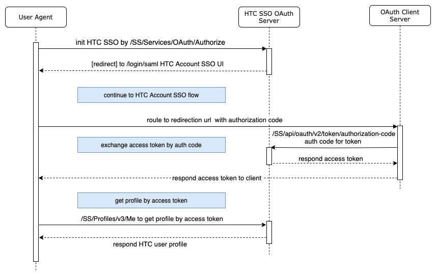

# OAuth Authorization Code flow

HTC Account SSO also support OAuth authorization code flow with web client. We suggest client to leverage this flow so the security could be guarded by server instead of user-agent. This integration will require server to fire extra two APIs to get HTC Account access token and fetch user profile by token as well. Below flow diagram display orderly to indicate how the server integrate with this flow.

Some client may integrate with HTC Account SSO as its only authentication strategy. In such case, client's user would need to logout from HTC server then redirect back to client's logout URL. If client need actively logout HTC SSO, please provide redirection logout url during HTC SSO OAuth client registration form.



Please follow below API spec. **Use stage domain for development and testing, but please config to production domain for production:**

### HTC Account Server Host Environment

| ENV | Resource Domain |
| :--- | :--- |
| STAGE | ​https://account-stage.htcvive.com |
| PRDO | ​https://account.htcvive.com |

### HTC Account Profile Server Host Environment

| ENV | Resource Domain |
| :--- | :--- |
| STAGE | https://account-profile-stage.htcvive.com |
| PROD | https://account-profile.htcvive.com |



Initial request for HTC SSO OAuth authorization code flow



Client's server fire this API to start HTC SSO OAuth authorization code flow.






Optional field for client would prefer redirect back to passive url for landing page instead of directly redirect to HTC SSO UI/UX web. "TRUE" value as enable passive mode, default is false.



Optional field with passive\_mode parameter. This url should defined in HTC SSO OAuth registration form.



HTC Account SSO UI/UX language code, client could set proper locale by this parameter.



state is JSON encoded string which allow client to carry its state and for HTC Account SSO UI/UX with preserved JSON properties. Please check below related section for more info.



registered OAuth scope, delimited by "+" for multiple scopes.



constant value "code" indicate it is for OAuth authorization code.



registered OAuth client id in UUID format.







1. If user not signed-in and not in passive mode, will redirect to HTC SSO UI/UX web.  
2. If user not signed-in and in passive mode with passive url, will redirect to passive url.  
3. If user already signed-in, redirect to redirection url with authorization code.  
  
Sample HTC SSO UI/UX web url:


```
https://account.htcvive.com/login/saml?hl=zh_TW&request=eyJJRCI6ImNjMmZkN2E4LTQ4ZTQtNDNjYS05ZDViLWZiYzBlMjc5Y2JkNyIsIklzc3VlciI6ImFjY291bnQuaHRjLmNvbSIsInRpbWVzdGFtcCI6IjIwMjEtMDYtMjBUMTc6Mzc6MzIuNjc2WiIsIk5vdE9uT3JBZnRlciI6IjIwMjEtMDYtMjBUMTc6Mzk6MzIuNjc2WiIsIlNlcnZpY2VQcm92aWRlciI6ImNjOTU1ZmZlLWIwODYtNDgwYy04NGEzLTQyODE4ZjEzODM5YiIsIkF1dGhvcml0aWVzIjoiIiwiRmllbGRzIjoiZm49MSxsbj0xIiwiQ2FsbGJhY2siOiJodHRwczovL2FjY291bnQuaHRjdml2ZS5jb20vUkFNL1NTLy9hcGkvb2F1dGgvdjEvYXV0aG9yaXplIiwiRGVzdGluYXRpb24iOiJodHRwczovL2FjY291bnQuaHRjdml2ZS5jb20vbG9naW4vc2FtbCIsIlZlcnNpb24iOjIsIlJlbGF5U3RhdGUiOiIxdTIxV3pxcndtZm05U29nSjhYTzF3SmR3djdUQUlBcEs5UitiUzI2VXczNU1sSm1TUTdOSTd5US8xMFdUMWN6cGJHTnZjV09HbWgvOEhGQjEzL25QckdGWDJwS0lFaFBIM2ZkdW1EV3BMWmNkYUFqYUVleXpFTTVmUkg3ZlJFeVdMVVJORDlySUVacEU3VVRvVXhvdXZBczNsNTJ3Vld6dDZ1ekdaem1Ka01ydFFOMDFPNElqbXcra284d0dwQlVZT3VnbG1WN2RyK0JaRWRwR09yelFjOHhKU0wxZTFvV1l1R1pGTHR0SEZzPSIsIkkxOG5JZCI6IlZpdmVwb3J0U3RvcmVXZWIiLCJWaWV3VHlwZSI6InBvcHVwIn0%3D&sigalg=SHA1withRSA&state=eyJjbGllbnRJZCI6ImNjOTU1ZmZlLWIwODYtNDgwYy04NGEzLTQyODE4ZjEzODM5YiIsInJlZGlyZWN0aW9uVXJsIjoiaHR0cHM6Ly93d3cudml2ZXBvcnQuY29tL3Nzby9hdXRoL2NhbGxiYWNrIiwiZmxvdyI6ImluZmluaXR5IiwiaW5pdFZpZXciOiJzaWduLWluIiwidmlld1RvZ2dsZXMiOltdLCJyZXF1aXJlQXV0aENvZGUiOnRydWUsInNjb3BlcyI6WyJpc3N1ZXRva2VuIiwiZW1haWwiLCJwYXltZW50LnNlY3VyaXR5LndyaXRlIl0sInByZVNpZ25VcFVybCI6Imh0dHBzOi8vd3d3LnZpdmVwb3J0LmNvbS9zdG9yZS9zZXR1cC9wbGFucyIsInBvc3RTaWduVXBVcmwiOiJodHRwczovL3d3dy52aXZlcG9ydC5jb20vc3RvcmUvc2V0dXAvY291bnRyeSIsInNlc3Npb25JZCI6IjU1MTUzYmYyLTdkNDUtMTExNi04YTBiLTkyZWJmNWJkM2Q4MSIsImNvb2tpZUNvbnNlbnQiOlsiZnVuY3Rpb25hbCJdLCJjdXN0b21SZWRpcmVjdFVybCI6Imh0dHBzOi8vd3d3LnZpdmVwb3J0LmNvbSJ9&signature=FDB5K3ky%2BBFJgF8Q0fPqhC2OOAxtRJhrRFdrClGllAalYIiQ8K5YBykWSVT7ttKblE83qdIqm9OmNG8fyst3KNpCnIbEWHb6IzMkU5gFUJ%2BBeaSduq7BEfDbRH6eobI3/NyuhoTpYMYDS1nKAW9S%2BUgPG5GfzA7X%2B%2BbsH%2BTUTt79DH3DRK8MLRAm3lhQKlW3ntKsj219Tnd9rz2tZZN2MziebwsqQrQZaCLL4RhSGawooqLKMmrGrlt/vzjVFNZEnyxWkIsehH8CAvczwzLyuUlvt%2Bv62PZn7aHJGjPR1gtcjuzT5TIC5myGVExob%2B4hS5s8NDEuO96wf%2BsOkXXYbw%3D%3D
```




If request validate failed, will respond as below json sample:


```
{"error":"invalid_client"}
```





#### Hl query parameter

Request's optional **hl** parameter allow client to config HTC SSO UI/UX locale. If not specify this parameter, HTC SSO UI/UX will use browser's preferred language instead. If preferred language not in below support list, will fallback to default locale **en\_US**. Support locales are:

```javascript
ar_EG
cs_CZ
da_DK
de_DE
es_US
zh_CN
zh_TW
es_ES
fi_FI
fr_FR
it_IT
ja_JP
ko_KR
nb_NO
nl_NL
pl_PL
ru_RU
sv_SE
en_US
```

#### State query parameter

As previous mentioned, client could merge extra data with state JSON, regarding preserved fields, please follow [auth configs for Web SSO V2](../infinity-flow-integration-1/auth-configs-for-sso-v2.md) or consult with HTC Account team for its flow UI/UX customization.

#### Sample request

```text
https://account.htcvive.com/SS/Services/OAuth/Authorize?hl=zh_TW&client_id=cc955ffe-b086-480c-84a3-42818f13839b&immediate=FALSE&response_type=code&state=%7B%22clientId%22%3A%22cc955ffe-b086-480c-84a3-42818f13839b%22%2C%22redirectionUrl%22%3A%22https%3A%2F%2Fwww.viveport.com%2Fsso%2Fauth%2Fcallback%22%2C%22flow%22%3A%22infinity%22%2C%22initView%22%3A%22sign-in%22%2C%22viewToggles%22%3A%5B%5D%2C%22requireAuthCode%22%3Atrue%2C%22scopes%22%3A%5B%22issuetoken%22%2C%22email%22%2C%22payment.security.write%22%5D%2C%22preSignUpUrl%22%3A%22https%3A%2F%2Fwww.viveport.com%2Fstore%2Fsetup%2Fplans%22%2C%22postSignUpUrl%22%3A%22https%3A%2F%2Fwww.viveport.com%2Fstore%2Fsetup%2Fcountry%22%2C%22sessionId%22%3A%2255153bf2-7d45-1116-8a0b-92ebf5bd3d81%22%2C%22cookieConsent%22%3A%5B%22functional%22%5D%2C%22customRedirectUrl%22%3A%22https%3A%2F%2Fwww.viveport.com%22%7D&redirection_url=https%3A%2F%2Fwww.viveport.com%2Fsso%2Fauth%2Fcallback&scope=issuetoken+email+payment.security.write
```



Get HTC Account access token by authorization code



Client server call this api with authorization code and client secret to get user's HTC Account access token






HTC SSO OAuth authorization code



OAuth client secret



OAuth client id







respond JSON with HTC Account access token


```
{
  "access_token": "OvgL7Vb/8+FyzpWfrsmDFCN10npcXKI9TfMiqppMT3KwaEMQAzisUFKxq+cDAik/LQe7aEs8HvegXzl3URpPaTNdfCsJDXpEKAJX4MdncLgUE9DnTvLRDsKT+rHsUfhJZwl9PtGbfhtKd3+/QxB56XZPyoSW57iDXuEDJUzO2M1NdCSdsHnMXKRU9F6EQagC0RhryV9JbXJFokJ5NCkcyT1mY8N+lYyENBchj+iSTjKKqDL10gvWiGbJDJ6B7tlPD2QHanuQs8c4ZeHGKcGCS1Yi2dx2Pyo119GsAVQchj62NgZIIgJowO2sOfOl8c/lyDoUgeLfAHlRqRjssv2NpIgTcJ9TSmkzNPryCqwGYLsXBFTyJFhQnIrSEAwC2QSJbQq2cd5SGAy42PPEulAu0AqlLbEx73Kt8ilLfcsUMi2yHd+h0Hwa/vp9XW2y9FOuRvJw9M7ULTkXNswE0/Vn+HEoXJPwgJo52pbjPNESljeNC/Fmmgl6JLqsV/O2VBGfEMqu8Emaeel4MkJOu3K0hi4Es1K3ajTMUlJw4crmx80GiJfwd5584KDuqntlw6MgZHO7QAxNLEyIOUlQUEC6kg+JwYVyxTpyYLEFtSa3Xet6vY/PTzPSegoWZw+bQHcZ7DD7hK6d0cL6MJIlTwtgUs+15rKfAN20iHXsZitTlEs=",
  "account_id": "9a7d1d8b-b5f9-4270-b06f-3bde43de0413",
  "client_id": "fd90b669-af39-4fe7-908f-dfd95166abca",
  "expires_in": 86400,
  "scope": "email birthday",
  "token_type": "bearer"
}
```







Get HTC Account profile by user access token



Client can get HTC Account profile by token and proper profile fields.






this used to indicate request profile field set and delimited by "," comma. Fields will be allowed and responded by token scope validation. Please check below listed values for reference.





HTC Account access token










```
{
    "createTime": 1574924921,
    "id": "7c08475a-9f77-481c-aef6-0104fd97ee7d",
    "firstName": "sadas",
    "lastName": "sadasd",
    "isVerified": true,
    "languageCode": "en_US",
    "accountEmail": "james_yang@htc.com",
    "contactEmailAddress": "james_yang@htc.com",
    "customProfilePicture": {
        "imageHref": "https://avatar.htcsense.com/img/7c08475a-9f77-481c-aef6-0104fd97ee7d/s500x500?v=1578401358",
        "provider": "htc",
        "width": 500,
        "height": 500
    },
    "profilePicture": {
        "imageHref": "https://avatar.htcsense.com/img/7c08475a-9f77-481c-aef6-0104fd97ee7d/s500x500?v=1578401358",
        "provider": "htc",
        "width": 500,
        "height": 500
    },
    "allowCollectUserData": false,
    "allowVRContentRecommendation": true,
    "sendEmailAboutViveProducts": true,
    "sendEmailAboutOtherProducts": true,
    "defaultOptIn": false,
    "location": "TW",
    "unresolved": [] 
}
```





#### Sample request URL

```text
https://account-profile.htcvive.com/SS/Profiles/v3/Me?fields=accountProvider,accountEmail,accountPhoneNumber,contactEmailAddress,location,createTime,firstName,id,isVerified,languageCode,lastName,defaultOptIn,integrationPhoneNumbers,socialProfilePicture,customProfilePicture,profilePicture,secondEmails,allowCollectUserData,allowVRContentRecommendation,sendEmailAboutViveProducts,sendEmailAboutOtherProducts
```

#### Profile fields list

```javascript
// field name list:
accountProvider
contactEmailAddress
createTime
accountEmail
accountPhoneNumber
firstName
id
isVerified
languageCode
lastName
regionId
allowCollectUserData
sendEmailAboutViveProducts
sendEmailAboutOtherProducts
secondEmails
profilePicture
customProfilePicture
socialProfilePicture
defaultOptIn
publicName
location
multiAuth
integrationPhoneNumbers
```



HTC Logout from client web 



This is for actively clean up HTC Account main site's session, the redirection behavior default is back to HTC Account main site. The redirection would route back to client's logout url if configured.








Clean out HTC Account SSO session, then redirect back to client's logout url.  
  
Sample url:


```
https://vivepor.com/customer/account/logout
```





