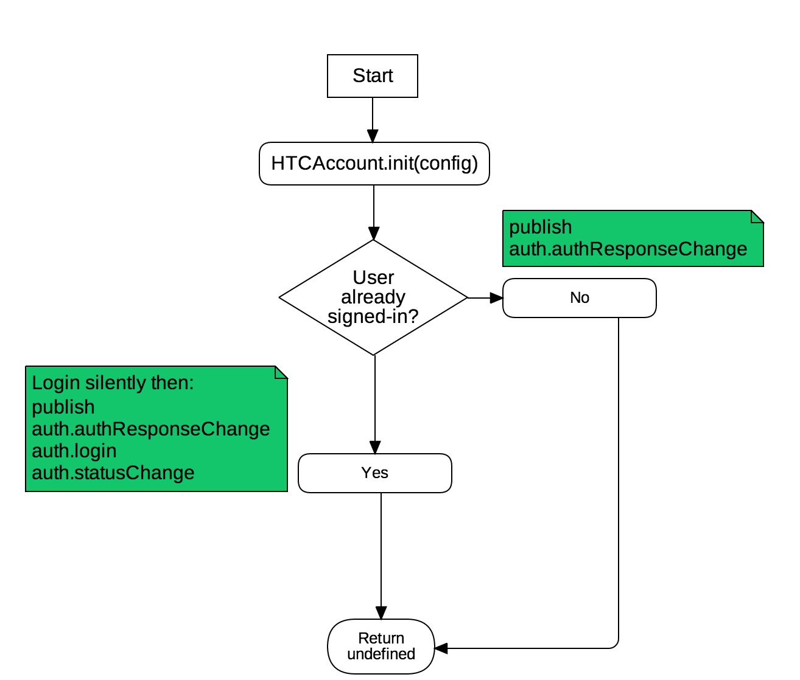
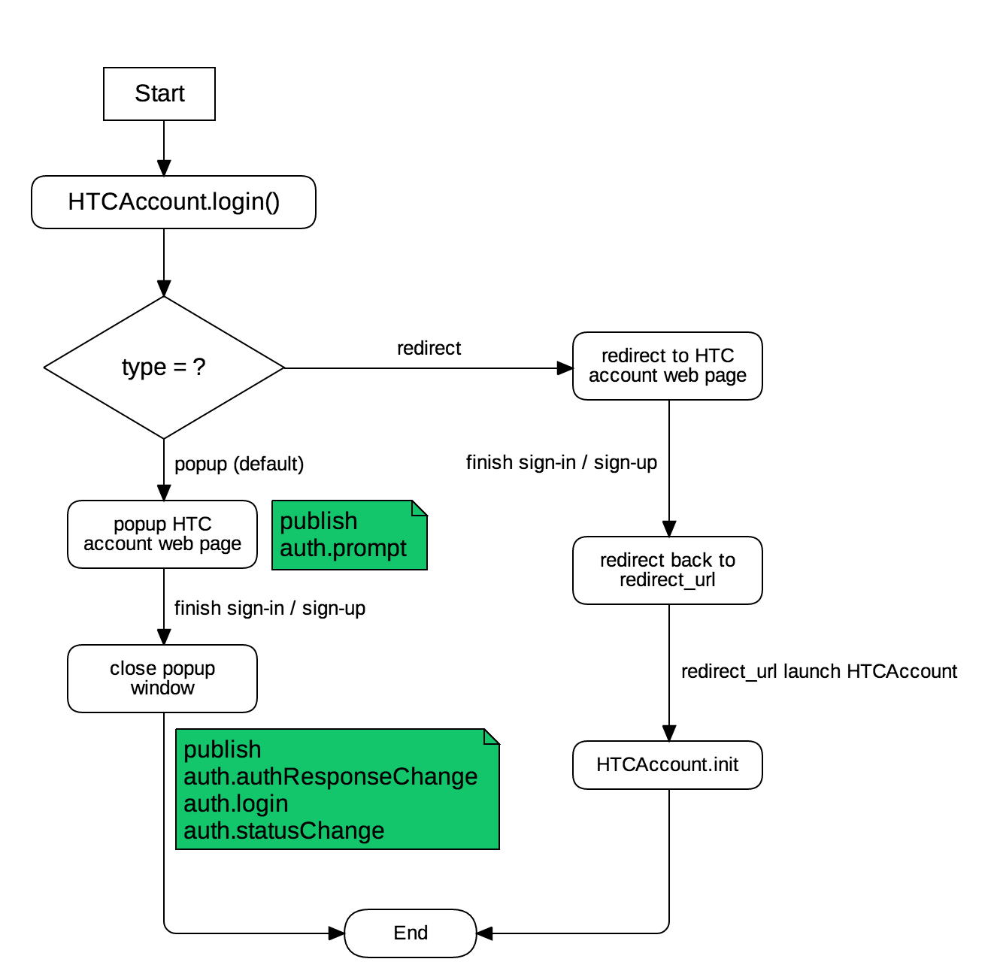

# API Specification

## Initialization

Before start using HTCAccount WEBSSO library, integrated client is required to setup the configurations. **For security concern, this binding will occurred only once**. The later `init` call will not able to reset the configured settings.



#### API

```javascript
HTCAccount.init(config): undefined
```

The **config** parameter is an object and expect to have properties as follow:

* `appid: String` - _A client id with UUID format which registered to HTC Account service._
* `scope: String` - _A string list all registered permitted scopes, all are seperated by a space._
* `authorities: String` - _You can omit this property and the WEBSSO library will set the default value based on user's GEO IP detection._

For GEO ip is located in non-China region, **authorities** default value is:

```javascript
authorities: "google.com facebook.com htc.com steam.com"
```

For GEO ip is located in China:

```javascript
authorities: "weibo.com qq.com htc.com"
```

If HTC WEBSSO library failed to get user's GEO ip, then the default value is `htc.com`.

You can remove specific authority by **prefixed minus sign, but the UI layout may not dynamically changed**.

```javascript
// Assume client is located in China
// Remove QQ social sign in button:
authorities: "weibo.com -qq.com htc.com"

// Or remove default authorities instead.
// Only permit Weibo and HTC sign-in:
authorities: "-weibo.com"
```

**Caveat!**

> In China region, `Facebook` and `Google` is not valid options for authorities. In Non-China region, `QQ` and `Weibo` also are invalid options.

**Example**:

```javascript
HTCAccount.init({
    appid: "0058ef13-1fed-4a0a-b6fb-1181cc525507",
    scope: "email birthday",
    authorities: "htc.com google.com"
})

// Or use authority default values
HTCAccount.init({
    appid: "50862c76-f334-4e09-8124-18206fe84aab",
    scope: "email profile.write"
})

// Or remove and assign specific authorities
HTCAccount.init({
    appid: "0058ef13-1fed-4a0a-b6fb-1181cc525507",
    scope: "email birthday",
    authorities: "htc.com -google.com -facebook.com"
})
```

## Login Status

Once the initialization has been done, then integrated client should able to check the login status in anytime.

#### API

```javascript
HTCAccount.getLoginStatus(callback(loginStatus), refresh = false): undefined/false
```

The `getLoginStatus` will first check whether the HTCAccount is successfully initialized.

If the `refresh` set to **true**, it will renew token and request a new login status.

The **callback** function accepts a parameter as login status response, the result should have one of two types:

```javascript
// User has signed in to HTC Account service.
{
    "status": "connected",
    "authResponse": {
        "access_token": "r8f7dIgXHIYOKfVqGr7YY....",
        "client_id": "5431c830-388a-46dc-929b-c9f9c7b16031",
        "expire": 1471776618831,
        "life": 86400000,
        "scope": "",
        "uid": "92bbb0ba-b8e4-4ab4-b8a3-70f2249fd689"   
    }
}

// User does not sign in to HTC Account service.
{
    "status": "unknown",
    "authResponse": false
}
```

The **loginStatus** is an object and have properties as follow:

* `status: String` - _Either_ `connected` _or_ `unknown`_._
* `authResponse: Object` - _Return a_ `authResponse` _object it status is **connected**, otherwise return_ `false`_._

The **authResponse** is an object and have properties as follow:

* `access_token: String` - _Access token to get user's resources._
* `expire: Number` - _The expiration time for access token._
* `uid: String` - _User's UUID._
* `client_id: String` - _Integrated client's application id._
* `scope: String` - _Access token scope, if it is an empty string, then it is default scope of the integrated client._

## Login

User can login to HTC Account service by either **redirection** or **popup** window.

In HTC account email/phone signup flow, **user will be blocked to verify page until the verification is passed**. This is design in purpose to sterength security. So the intergrated client should consider this scenario for better user experience.



#### API

```javascript
HTCAccount.login(stateCallbackObject, options): undefined
```

**Caveat!**

> Avoid wrapping `HTCAccount.login()` in Promises/A functions or `setTimeout` function, it would cause the login popup page get blocked by some browsers.

The **stateCallbackObject** should carry client data then back to client's redirection URL. But currently this feature has not implemented yet. So **please pass an no-ops object instead**.

The **options** is an object and have properties as follow:

* `type: String` - _Either_ `redirect` _or_ `popup`_._
* `next_url: String` - _When type is_ `redirect`_, then the_ `next_url` _should be registered its subpath, either start with **`"/"`** or client's same domain relative path._
* `authorities: String` - _Please refer to_ `HTCAccount.init` _**config** object for its usage._

**Example**

```javascript
// Use default popup window, next_url is registered redirection url
HTCAccount.login();

// Cusomized options
HTCAccount.login({ /* state callback object */ }, {
    type: "redirect",
    next_url: "/sub/path",
    authorities: "-qq.com"
})
```

### Logout

Integrated Client can listen below listed event in order after user logout HTC account service:

* `auth.authResponseChange`
* `auth.logout`
* `auth.statusChange`

#### API

```javascript
HTCAccount.logout(callback(loginStatus)): undefined/false
```

Similar as login API, the `callback` accepts a parameter which return login status. After logout, the login status should be as follow:

```javascript
{ status: "unknown", authResponse: false }
```

### Get Auth Response

Integrated client can get auth response in anytime. There has three types of response:

#### API

```javascript
HTCAccount.getAuthResponseV2(): authResponse/false/errorJSON
```

```javascript
// User has logout or not sign-in yet
false

// ErroJson - User block third party API
{
  error: 403
  authResponse: "Fail to load cookie, please allow 3rd party cookie access control"
}

// ErroJson - User does not have cookie key _htcsso
{
  error: 500
  authResponse: "Fail to set cookie"
}

// User has signed-in
{
    "access_token": "r8f7dIgXHIYOKfVqGr7YY....",
    "client_id": "5431c830-388a-46dc-929b-c9f9c7b16031",
    "expire": 1471776618831,
    "life": 86400000,
    "scope": "",
    "uid": "92bbb0ba-b8e4-4ab4-b8a3-70f2249fd689"   
}
```

#### Caveat!

For current lib user, We suggest to **use** `getAuthResponseV2` **instead of** `getAuthresponse` **API**, so you can have errorJSON response to **know whether user disallowed 3-rd party cookie which lead the login status in cookie is not persisted**.

### Get User Profile

Integrated client can get user profile data from HTC Profile service. Please use `getProfileV3` for better integration.

#### API

```javascript
// Deprecated
HTCAccount.getProfile(successCallback(result, status), failedCallback(result, status))
// will request to legacy identity service:
// /Services/AccountsExtn.svc/Accounts/RetrieveAccountProfile/	

// Will Deprecated
HTCAccount.getProfileV2(successCallback(result, status), failedCallback(result, status))
// will request to identity profile service:
// /Profiles/Me

// Stable
HTCAccount.getProfileV3(successCallback(result, status), failedCallback(result, status))
// will request to identity profile service:
// /Profiles/v2/Me
```

**Caveat!**

> The **failedCallback** should also supplied. Otherwise this API will not properly execute callback functions.

Both callback accept two parameters, the `status` is AJAX related value, the `result` have several pattern as follow:

#### Basic Attributes:

* `id: String` - _user account id with UUID format._
* `isVerified: Boolean` - _Identify user's HTC email/phone account verification status._
* `sendEmailAboutProducts: Boolean` - _A boolean value to allow HTC send product email to that user._
* `languageCode: String` - _User preferred language. The product or verification email will set as this language translated text._
* `gender: String`
* `accountProvider: String` - _Associated account provider name, either_ `htc`_,_ `google`_,_ `facebook`_,_ `qq`_,_ `weibo`_, or_ `steam`_._

To inquiry needed fields or get more profile data please contact HTC Account team to grant related scope permission.

Example:

```javascript
// scope with empty string
{
    "id": "e3f07451-f4f3-44d3-90da-3e9eb4f349af",
    "isVerified": true,
    "firstName": "John",
    "lastName": "Doe",
    "sendEmailAboutProducts": false,
    "languageCode": "en_US",
    "gender": "male"
}

// scope with "email" string
{
    "id": "e3f07451-f4f3-44d3-90da-3e9eb4f349af",
    "isVerified": true,
    "firstName": "John",
    "lastName": "Doe",
    "sendEmailAboutProducts": true,
    "languageCode": "zh_TW",
    "gender": "male",
    "accountProvider": "google"
    "contactEmailAddress": "john_doe@gmail.com"
}
```

### Get User Organization Profile

Integrated client can get user profile data from HTC Profile service

#### API

```javascript
HTCAccount.getOrgProfile(successCallback(result, status), failedCallback(result, status))
```

**Caveat!**

> The **failedCallback** should also supplied. Otherwise this API will not properly execute callback functions.

Both callback accept two parameters, the `status` is AJAX related value, the `result` have several pattern as follow:

#### Basic Attributes:

* `creatorId: String` - _user account id with UUID format._
* `organizationId: String` - _organization account id with UUID format._
* `name: String` - _Company name._
* `address: String` - _Company address._
* `languageCode: String` - _User preferred language. The product or verification email will set as this language translated text._
* `country: String`- Country code for organization
* `taxId: String` - tax id for organization
* `city: String` 
* `newsLetterOptIn: Boolean`-If allow HTC to send email to user
* `contactEmail: String`-contact emil for organization

Example:

```javascript
{
	"organizations": [
		{
			"creatorId": "849ce8ac-3c51-4eb2-8471-ca128692f1db",
			"organizationId": "0252f2c9-6e55-46bc-939a-04a494b31dec",
			"name": "testCompany",
			"address": "中興路三段88號,中興路三段88號2",
			"country": "US",
			"languageCode": "en-US",
			"taxId": "testVAT",
			"city": "新店區",
			"zipCode": "255",
			"createTime": 1532331018095,
			"updateTime": 1532331018095,
			"newsLetterOptIn": true,
			"contactEmail": "test@email.com"
		}
	]
}
```

### Event Subscription Handler

Integrated client can inspect or listen event change by event handlers.

#### API

```javascript
HTCAccount.Event.subscribe(channel, handler)

HTCAccount.Event.unsubscribe(channel, handler)
```

Supported event channels are:

* `auth.authResponseChange`:

  Fire event when the authResponse changed, such as `login`, `logout`, `getLoginStatus(callback, refresh = true)`.

* `auth.login` - _Fire event when user login successfully._
* `auth.logout` - _Fire event after user logout and account session data is cleaned._
* `auth.prompt` - _Fire event when popup window is opened, only in popup mode._
* `auth.statusChange` - _Fire event when login status changed, or access token renewed._

**Example**

```javascript
// auth.authResponseChange
HTCAccount.Event.subscribe("auth.authResponseChange", function(loginStatus) {
    if (loginStatus["status"] === "connected") {
        // apply application logic after login
    } else { // loginStatus["status"] === "unknown"
        // apply application logic after logout
    }
});

// auth.login
HTCAccount.Event.subscribe("auth.login", function(loginStatus) {
    // apply application logic
});

// auth.logout
HTCAccount.Event.subscribe("auth.logout", function(loginStatus) {
    // apply application logic
});

// auth.prompt
// Only fire when login type is popup mode.
HTCAccount.Event.subscribe("auth.prompt", function(loginStatus) {
    // apply application logic after popup window opened
});
```

### Go to create-profile page

When user is in login status, this API allows user to go to create-profile page directly.


If user is not in Login status, the API will invoke fail callback function. If user has already owned org-profile data more than one, the API will invoke fail callback function.


#### API

```javascript
HTCAccount.createOrgProfile(failedCallback(result, status));
```

### Verify Auth Key

A wrapper of `/api/oauth/v2/verify-token` to verify user auth key for web SSO client. 

#### API

```text
HTCAccount.verifyTokenV2(success_callback, failed_callback, checkMainSiteAuthKey);
```

#### Parameters

| Parameter Name | Required | Type | Description |
| :--- | :--- | :--- | :--- |
| success\_callback | Y | Function | Callback for succeed response, its first parameter accept succeed JSON response, for JSON fields, please check OAuth verify-token API |
| failed\_callback | Y | Function | Callback for succeed response, its first parameter accept failed JSON response |
| checkMainSiteAuthKey | N | Boolean | check main site domain's auth key cookie whether is expired. default set to **false.** |

#### Error Responses


The error response should refer to OAuth verify token API, and with extra error code **4031010** for main site auth key check:

`{   
  "code": 4031010,   
  "msg": "main site token expired, please relogged in"   
}` 

If error code is **negative number as** unexpected errors, please report to account team for troubleshooting.

Or other error response code from OAuth API document:

[https://id-dev-swagger.htcwowdev.com/docs\_oauth](https://id-dev-swagger.htcwowdev.com/docs_oauth)



